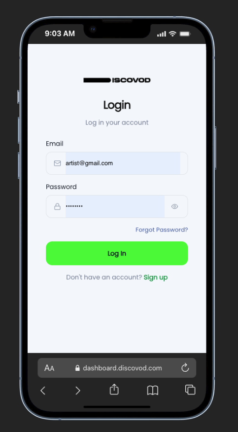
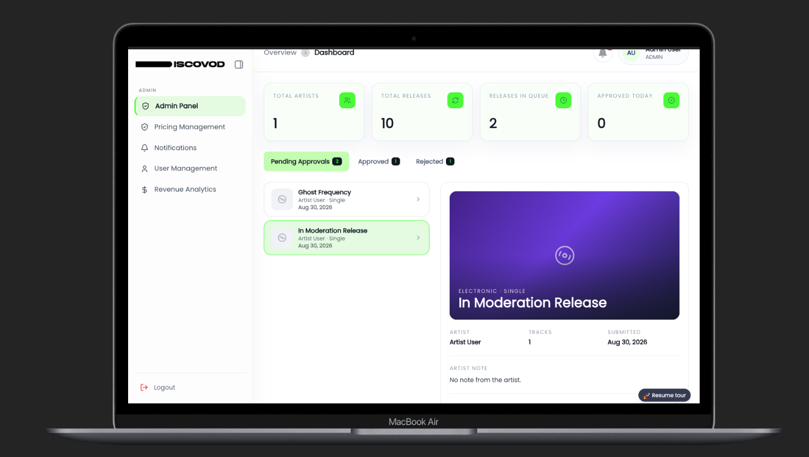
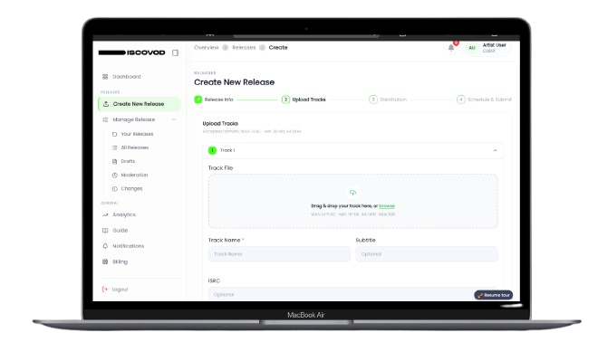
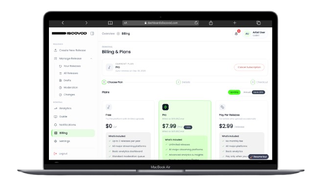

<div align="center">


# ZvonSystems Dashboard

**A production-grade, role-based management dashboard for the ZvonSystems digital music distribution platform.**

Built with Next.js 16 (App Router), Redux Toolkit, and Tailwind CSS — powering artist release management, subscription billing, real-time notifications, and platform administration in one cohesive web application.

</div>

---

## Table of Contents

- [Overview](#overview)
- [Key Features](#-key-features)
- [Tech Stack](#-tech-stack)
- [Project Structure](#-project-structure)
- [Getting Started](#-getting-started)
- [Environment Variables](#-environment-variables)
- [Available Scripts](#-available-scripts)
- [Roles & Access](#-roles--access)
- [Feature Areas](#-feature-areas)
- [Real-Time Notifications](#-real-time-notifications)
- [Design Mode](#-design-mode)
- [Security](#-security)
- [Docker Deployment](#-docker-deployment)
- [Production Deployment](#-production-deployment)
- [Screenshots](#-screenshots)
- [Contributing](#-contributing)
- [License](#-license)

---

## Overview

The **ZvonSystems Dashboard** is the central web console for the ZvonSystems digital distribution service. It serves two distinct audiences behind a single, secure application:

| Audience | Workspace | Description |
| --- | --- | --- |
| **Artists / Labels** (`CLIENT`) | `/admin/dashboard` | Create, moderate, and distribute music releases; manage billing, subscription plans, notifications, analytics, and account settings. |
| **Platform Administrators** (`ADMIN`) | `/super-admin/dashboard` | Oversee users, revenue analytics, pricing/payment plans, and platform-level releases. |

The frontend is fully integrated with the ZvonSystems REST API (`https://api.discovod.com/api`) through a typed RTK Query layer, consumes real-time events over Socket.IO, and ships with hardened security headers, Docker support, and an isolated **Design Mode** for rapid UI prototyping against mocked data.

---
## 📸 Screenshots

> 👉 Add your screenshots here — drop images into `public/screenshots/` and reference them below (or share them with the maintainer to embed).

| Login | Admin Dashboard |
## 📸 Screenshots

### 🔐 Authentication & Dashboard

<p align="center">
  
  
</p>

### 🎵 Release Management & Billing

<p align="center">
  
  
</p>

## ✨ Key Features

- **🔐 Secure, role-aware authentication**
  - Login / Sign-up / Forgot-password flows.
  - Middleware-based route guarding via `src/proxy.ts` with cookie-based sessions (`zvn_auth_token`, `zvn_refresh_token`, `zvn_auth_role`).
  - Silent access-token refresh on `401` with automatic re-attempt and graceful re-login on expired sessions.

- **🎵 Complete release lifecycle** (admin workspace)
  - Multi-step release creation: release metadata → audio track upload (MP3/WAV) → artwork upload → distribution options → schedule & submit.
  - Draft management, "your releases" library, and moderation queue with change requests and moderator feedback.
  - Release detail pages with status badges and per-step validation.

- **💳 Subscription & billing**
  - Plan showcase with monthly/yearly billing toggle.
  - Seamless checkout flow supporting **PayPal** and **CloudPayments** gateways.
  - Card entry with expiry date picker, order summary, invoice history, payment method management, and cancellation flow.

- **📊 Analytics & dashboards**
  - Overview KPI dashboards for artists and platform admins.
  - Revenue analytics with charts (Chart.js + Recharts).

- **🔔 Real-time notifications**
  - Global notification center with unread badge, mark-as-read / read-all, powered by **Socket.IO** (`notification:new`, `notification:unread:updated`).
  - Per-user notification preferences (release status, moderation feedback, weekly digest, etc.).

- **🧭 Guided onboarding**
  - Interactive product tour built with **Driver.js**, staged across first-time user journeys.

- **🌐 Media proxy layer**
  - `/api/media` resolves backend storage paths and absolute (e.g., ngrok) media URLs into same-origin previews for `` / `next/image`.

- **🎨 Design Mode**
  - Toggle `NEXT_PUBLIC_DESIGN_MODE=true` to bypass auth and render the full UI against fabricated RTK Query responses — ideal for design iteration without a backend.

---

## 🧰 Tech Stack

| Layer | Technology |
| --- | --- |
| **Framework** | [Next.js 16](https://nextjs.org) (App Router, Server Components, Middleware) |
| **UI Library** | [React 19](https://react.dev) + TypeScript 5 (strict mode) |
| **Styling** | [Tailwind CSS v4](https://tailwindcss.com) + CSS-variable design tokens |
| **State & Data** | [Redux Toolkit](https://redux-toolkit.js.org) + [RTK Query](https://redux-toolkit.js.org/rtk-query/overview) + React Redux |
| **Real-time** | Socket.IO Client (`socket.io-client`) |
| **Components** | Radix UI primitives (Dialog, Dropdown, Collapsible, Tooltip, Slot, Avatar, Separator) |
| **Forms** | React Hook Form, react-day-picker, country-data-list |
| **Charts** | Chart.js + react-chartjs-2, Recharts |
| **Icons** | Lucide React, React Icons |
| **Utilities** | clsx, tailwind-merge, class-variance-authority, date-fns, js-cookie, react-hot-toast |
| **Onboarding** | Driver.js |
| **Extras** | jsPDF, react-qr-code, react-circle-flags, nextjs-toploader |
| **Deployment** | Docker (multi-stage, `node:22-alpine`) + Docker Compose |

---

## 📁 Project Structure

```text
zvonsystem-dashboard/
├── public/                      # Static assets (logo, fonts, images, audio)
├── src/
│   ├── app/                     # Next.js App Router
│   │   ├── (public)/            # Auth pages: /login, /sign-up, /forgot-password
│   │   ├── (protected)/
│   │   │   ├── (admin)/         # /admin/dashboard/**   (CLIENT workspace)
│   │   │   └── (super-admin)/   # /super-admin/dashboard/** (ADMIN workspace)
│   │   ├── api/media/route.ts   # Media proxy: storage path → same-origin preview
│   │   └── payment/success/     # Payment confirmation page
│   ├── components/              # Feature components (admin, shared, UI primitives)
│   ├── context/                 # React context (e.g., NotificationContext)
│   ├── icons/                   # Inline SVG icon components
│   ├── layout/                  # App shell: AppHeader, AppSidebar, Backdrop
│   ├── lib/                     # Env config, auth guards, routes, mappers, helpers
│   ├── redux/                   # Redux store, RTK Query API modules, slices
│   ├── sharedComponents/        # Reusable layouts + shared UI
│   ├── types/                   # Shared TypeScript domain types
│   └── proxy.ts                 # Auth-aware middleware (route protection)
├── Dockerfile                   # Multi-stage production build
├── docker-compose.yml           # One-command container startup
├── next.config.ts               # Security headers, image domains, SVG webpack rules
└── package.json
```

---

## 🚀 Getting Started

### Prerequisites

- **Node.js 20+** (Node 22 recommended — used by the production image)
- **npm** (or your package manager of choice)
- A running ZvonSystems API backend (optional for Design Mode)

### 1. Install dependencies

```bash
npm install
```

### 2. Configure environment

```bash
cp .env.example .env.local
```

| Variable | Required | Description |
| --- | --- | --- |
| `NEXT_PUBLIC_API_BASE_URL` | ✅ | Base URL of the ZvonSystems REST API, e.g. `https://example.com/api`. |
| `NEXT_PUBLIC_MEDIA_BASE_URL` | ✅ | Public origin used to resolve uploaded media/storage paths, e.g. `https://example.com`. |
| `NEXT_PUBLIC_SOCKET_URL` | ✅* | Socket.IO notification endpoint, e.g. `https://example.com/notifications`. |
| `NEXT_PUBLIC_DESIGN_MODE` | ❌ | Set to `true` to run the UI against mocked data without auth or backend (`default: false`). |

> ⚠️ `NEXT_PUBLIC_*` variables are **inlined at build time**. They must be provided both for `next build` and at Docker image build time (see [Docker Deployment](#-docker-deployment)). Create a `.env.local` for development, but never commit real secrets.

### 3. Start the development server

```bash
npm run dev
```

Open [http://localhost:3000](http://localhost:3000) — unauthenticated visitors are redirected to `/login`.
---

## 🌱 Environment Variables

All configuration is centralised in [`src/lib/env.ts`](./src/lib/env.ts) and read from `process.env`:

```bash
# API
NEXT_PUBLIC_API_BASE_URL=https://example.com/api

# Media
NEXT_PUBLIC_MEDIA_BASE_URL=https://example.com

# Socket
NEXT_PUBLIC_SOCKET_URL=https://example.com/notifications

# Design mode
NEXT_PUBLIC_DESIGN_MODE=false
```

---

## 📜 Available Scripts

| Command | Description |
| --- | --- |
| `npm run dev` | Start the development server with hot reload. |
| `npm run build` | Create an optimized production build (requires `NEXT_PUBLIC_*` vars). |
| `npm run start` | Serve the production build locally. |
| `npm run lint` | Run ESLint across the codebase. |

---

## 👥 Roles & Access

Access is enforced in two layers — the Next.js middleware (`src/proxy.ts`) and client-side role guards.

| Path | Middleware rule | Who can access |
| --- | --- | --- |
| `/login` | Authenticated users are redirected to their workspace | Public |
| `/sign-up`, `/forgot-password` | Authenticated users are redirected to their workspace | Public |
| `/` | Redirects to `/login` or the role's default workspace | Public |
| `/admin/dashboard/**` | Requires `CLIENT` role | Artists / Labels |
| `/super-admin/dashboard/**` | Requires `ADMIN` role | Platform administrators |

**Default post-login destinations:**

- `CLIENT` → `/admin/dashboard`
- `ADMIN` → `/super-admin/dashboard`

---

## 🗂 Feature Areas

### Admin workspace (`/admin/dashboard`)

- **Analytics** — KPI cards and charts for release/subscription performance.
- **Releases**
  - `/releases` — all releases, `create` — stepped release builder, `drafts` — saved drafts,
  - `your-releases` — artist library, `moderation` — moderation status queue, `changes` — change requests with moderator feedback, `[releaseId]` — release detail.
- **Billing** — plans, checkout (PayPal / CloudPayments), invoices, and subscription management.
- **Guide** — first-run onboarding tour.
- **Notifications** — full notification center.
- **Settings** — profile, account, region, security, and notification preferences.

### Super-admin workspace (`/super-admin/dashboard`)

- **User management** — platform user oversight.
- **Revenue analytics** — cross-platform revenue reporting.
- **Pricing management** — subscription plan definition and pricing.
- **Releases** — platform-wide release detail view.
- **Notifications** — administrator notification center.

---

## 🔔 Real-Time Notifications

The notification pipeline is event-driven end-to-end:

- **Socket events** — `notification:new` (incoming), `notification:unread:updated` (unread badge sync).
- **Client service** — `src/lib/notification/notificationService.ts` manages the Socket.IO connection lifecycle.
- **Global state** — `NotificationContext` provides `notifications`, `unreadCount`, `markRead()`, `markAllRead()` to any consumer.
- **API** — REST endpoints `/notifications`, mark-one-read, and read-all backed by RTK Query, with paginated response shape `{ success, message, data, meta }`.

> 📄 See [`NOTIFICATION_SYSTEM_IMPLEMENTATION.md`](./NOTIFICATION_SYSTEM_IMPLEMENTATION.md) for the full integration spec.

---

## 🎨 Design Mode

Set `NEXT_PUBLIC_DESIGN_MODE=true` in your environment to:

- Bypass auth middleware and visit every page directly.
- Feed every RTK Query endpoint with deterministic **mocked responses** (see `src/redux/api/designMode.ts`).
- Build and review UI in isolation from network/backend availability.

> **Do not** enable Design Mode in staging or production.

---

## 🔒 Security

The application ships with defence-in-depth HTTP headers applied globally in [`next.config.ts`](./next.config.ts):

| Header | Value (summary) |
| --- | --- |
| `Content-Security-Policy` | Tight origin allow-list for scripts, styles, images, fonts, connect (API + WSS), media, workers; `object-src 'none'`, `base-uri 'self'`, `form-action 'self'`, `upgrade-insecure-requests`. |
| `Strict-Transport-Security` | `max-age=31536000; includeSubDomains` |
| `X-Frame-Options` | `SAMEORIGIN` (frame-ancestors also restricted) |
| `X-Content-Type-Options` | `nosniff` |
| `Referrer-Policy` | `strict-origin-when-cross-origin` |
| `Permissions-Policy` | Camera, microphone, geolocation, payment, USB disabled |

Additional hardening:

- Non-root `nextjs` user in the production Docker image.
- Session token & role cookies with server-side validation on every protected request.
- Automatic `401` handling with single-flight token refresh to avoid refresh storms.
---

## 🐳 Docker Deployment

A multi-stage `Dockerfile` (install → build → minimal runtime) on `node:22-alpine` produces a standalone, non-root production image.

```bash
# Build with build-time env vars
docker build \
  --build-arg NEXT_PUBLIC_API_BASE_URL=https://example.com/api \
  --build-arg NEXT_PUBLIC_DESIGN_MODE=false \
  -t zvonsystem-dashboard .

# Run
docker run -p 3000:3000 zvonsystem-dashboard
```

Or simply use Docker Compose:

```bash
docker compose up -d --build
```

This exposes the dashboard on `http://localhost:3000` (defaults from `docker-compose.yml`).

> `NEXT_PUBLIC_*` values are baked into the bundle at build time — rebuild the image whenever they change.

---

## ☁️ Production Deployment

The app is a standard Next.js 16 application and works with any Node or serverless hosting:

1. **Build** — `npm run build` with the correct `NEXT_PUBLIC_*` environment.
2. **Serve** — `npm run start` (Node) or deploy the `Dockerfile` build output.
3. **Reverse proxy** — terminate TLS and forward to port `3000`; ensure the API domain (`api.discovod.com`) is reachable and present in the Next.js image allow-list.
4. **Media** — uploads are relayed through the same-origin `/api/media` proxy automatically, so no extra CDN setup is required.

---

## 🤝 Contributing

1. Fork the repository and create a feature branch from `api-integration`.
2. Keep changes scoped and run `npm run lint` before pushing.
3. Follow existing conventions — typed RTK Query endpoints, Tailwind token-based styling, modular feature components.
4. Open a pull request with a clear description of the change and relevant screenshots.

---

## 📄 License

All rights reserved © ZvonSystems.
